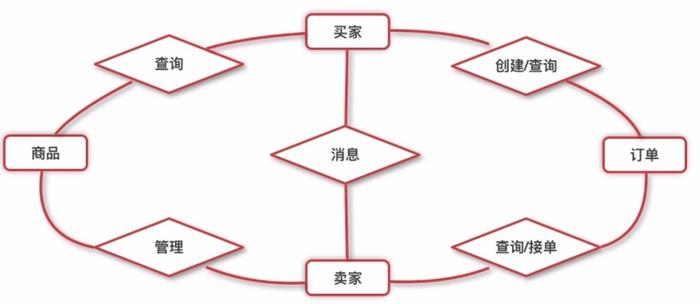
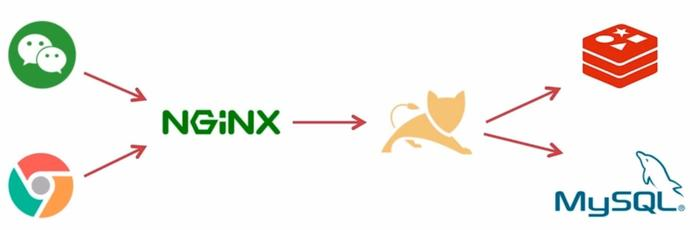

## weixin-sell项目：
 

### 项目介绍：
#### Spring Boot微信点餐系统  
##### 技术要点：项目采用前后端分离，通过RESTful接口进行通信
- 前端：Vue -> WebApp
- 后端：SpringBoot + Bootstrap + Freemarker + jQuery 
        数据库：SpringBoot + JPA、SpringBoot + MyBatis 
        缓存：SpringBoot + Redis（分布式session、分布式锁） 
        消息推送：WebSocket 
- 微信相关特性：扫码登录、模板消息推送、微信支付和退款
##### 功能分析：
- 买家（微信端），是一个基于微信服务号点餐 
- 卖家（PC端），是一个后台管理系统 
功能关系图：
 
部署架构图：

- 时间：        
    startDate：2018-12-8
    endDate:
    
 

>### 环境参数：
    SpringBoot：1.5.10
    JDK 1.8.0_111   
    Idea 2017.3.4
    Maven 3.3.9
    Redis 3.2.100
    Nginx 1.11.7
    开发环境 Linux
    部署环境 centos7.3
